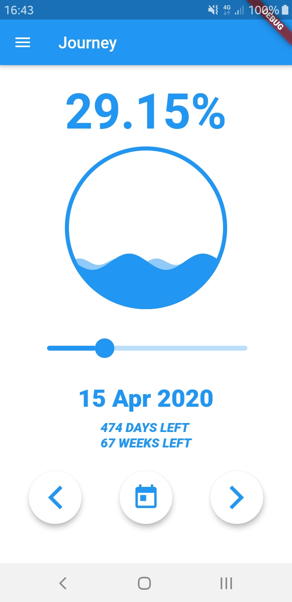
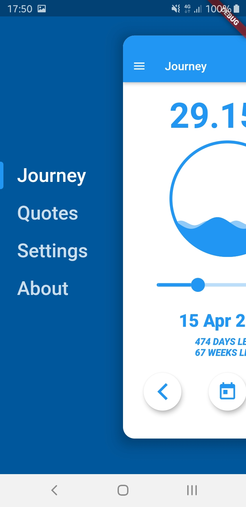
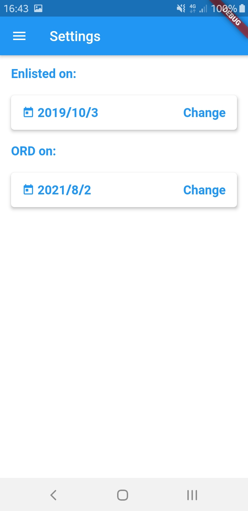

# Flutter-OrdHowLong

### Description

A simple ORD countdown app created in Flutter. Includes daily inspirational quotes and a slidable progress bar to view the forecasted progress in terms of dates.

### Screenshots

 | 
:-------------------------:|:-------------------------:
 |  

### Web App

You can access the compiled web app here: http://zst123.github.io/Flutter-OrdHowLong/

It is hosted here on Github Pages from the `docs/` directory.

### Android App

- [Debug: app-debug-20200415.apk](app-debug-20200415.apk)

- [Release: app-release-20200415.apk](app-release-20200415.apk)

### Compiling

Android

- Import and build the project with Android Studio

Web

	$ flutter build web
	$ flutter run -d web-server --release
	$ cp -r ./build/web/ ./docs/
